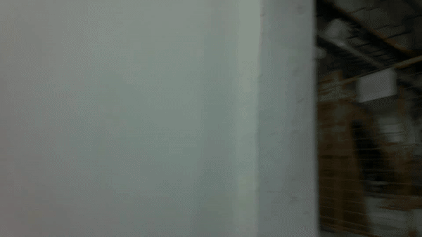
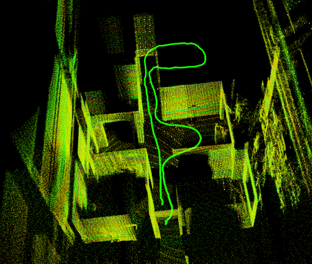

# HCIC-Construction-VSLAM-Dataset

**Developer**: Wenyu Li, Xinyu Chen, Yantao Yu
**Affiliation**: The Hong Kong University of Science and Technology

This is a description of our dataset paper: A real world visual slam dataset for indoor construction sites


<!---->
<!---->


<div style="display: flex;">
  
  
</div>


## Download 

It will be released after the paper is accepted.

| Sequence                 | Duration | Size  | Description                           | Link   |
| ------------------------ | -------- | ----- | ------------------------------------- | ------ |
| Building A1, static      | 85s      | 9.30G | Texture-less, multiple rooms          | Rosbag |
| Building B1, static      | 78s      | 8.30G | Repetitive texture, looped trajectory | Rosbag |
| Floor14, static2         | 56s      | 7.32G | Over-exposure                         | Rosbag |
| Floor4,  static1         | 35s      | 4.56G | Glass, static workers                 | Rosbag |
| Floor4, static3          | 24s      | 3.08G | Texture-less, single room             | Rosbag |
| Floor1, dynamic (filter) | 55s      | 5.43G | Motion blur, dynamic workers          | Rosbag |

- Floor1 is a segment from the raw sequence and does not contain tf messages. You can use the transformations from other sequences.


## Hardware

Include a RealSense L515 camera and a Ouster OS0-128 lidar. See our paper for more information about these sensors.

<div style="display: flex; flex-direction: column; align-items: center;">
  <div style="display: flex; width: 100%; justify-content: center;">
    <figure style="margin-right: 5%;">
      
      <figcaption style="text-align: center;">RealSense L515</figcaption>
    </figure>
    <figure>
      
      <figcaption style="text-align: center;">Ouster OS0-128</figcaption>
    </figure>
  </div>
  <div style="width: 100%; margin-top: -30px; display: flex; justify-content: center;">
    <figure style="width: 70%;">
      
      <figcaption style="text-align: center;">Sensor Data</figcaption>
    </figure>
  </div>
</div>


## Prerequisites
### Ubuntu and ROS

The dataset is recorded in rosbag. So we recommend you using Ubuntu and ROS. We test the system on ROS Noetic and Ubuntu 20.04. Other versions should be possible.

To use the provided lidar slam ground truth and visual slam benchmark, you need to install docker on your computer. If you are going to run them on your host machine, you might need to do some modification ( follow the original  repositories or instructions in our dockerfile).


### host machine(not recommend)

You need to check if these systems support your ubuntu or ros version. Melodic or Noetic should be a good choice. Make sure your could run popular slams on your computer and just directly use our provided rosbags in your own system.


### Docker(recommend)

If you are tired of struggling with the environments required by different repositories, you can have a try on our docker scripts.


Install docker engine and nvidia-docker(optional, but recommend), please follow the official docs.  **Do NOT install docker desktop.**

    https://docs.docker.com/engine/install/ubuntu/
    
    https://docs.nvidia.com/datacenter/cloud-native/container-toolkit/install-guide.html#docker


After installation, cd to the corresponding **docker** folder on your host machine, you will see three files. Change the name of docker image, docker container, path folder on your computer, etc.

```
├── ros_package_xxx/
│   ├── docker/
│   │   ├── build.sh
│   │   ├── Dockerfile
│   │   └── run.sh
│   ├── launch
│   ├── src
│   ├── ...
│   ├── CMakeLists.txt
│   └── package.xml
```


You can also run on a machine without nvidia display card. Just try :

```
# delete  "--gpus all " in the run .sh file.

docker run -it --name $container_name --gpus all \
```

```
# delete these lines in Dockerfile

ENV NVIDIA_VISIBLE_DEVICES ${NVIDIA_VISIBLE_DEVICES:-all}
ENV NVIDIA_DRIVER_CAPABILITIES ${NVIDIA_DRIVER_CAPABILITIES:+$NVIDIA_DRIVER_CAPABILITIES,}graphics
```


Compile docker image  on your host computer. It will take some time, depending on your internet.

```
bash build.sh
```


Start a new docker container. After that you can use the container(See docker official docs). You can use run.sh for multiple times. The old container will be instead with the new one.

```
bash run.sh
```


In our setting container,  /root is your working space. In the /root folder, catkin_ws is your ros workspace; dataset and downloads are connected to your host machine; start.sh is a starting script for compiling and preparation, you can change it at the end of the dockerfile.


To enable rviz in the container, enter on your host machine.

```
xhost +
```


### Sensor Drivers(optional)

If you want better support on the sensors, you may also want to install their ros drivers. To install on your host machine or docker container: 

**For RealSense:**

```
apt-get update && apt-get -y install apt-transport-https && \
    mkdir -p /etc/apt/keyrings && \
    curl -sSf https://librealsense.intel.com/Debian/librealsense.pgp | tee /etc/apt/keyrings/librealsense.pgp > /dev/null && \
    echo "deb [signed-by=/etc/apt/keyrings/librealsense.pgp] https://librealsense.intel.com/Debian/apt-repo `lsb_release -cs` main" | \
    tee /etc/apt/sources.list.d/librealsense.list 
```
```
apt-get update && apt-get install -y \
    librealsense2-dkms \
    librealsense2-utils \
    librealsense2-dev
```

```
apt-get update && apt install -y ros-melodic-realsense2-camera
```

**For Ouster:**

```
 apt-get update && apt-get install -y \
    ros-noetic-pcl-ros \
    ros-noetic-rviz \
    libspdlog-dev  
```

Download in your ros workspace.

```
 git clone --recurse-submodules https://github.com/ouster-lidar/ouster-ros.git
```


## Ground Truth

You are encouraged to use your own lidar slam as the ground truth based on our provided lidar data for higher accuracy evaluation. But here we also offer you an out of the box package configured in docker. It originates from [LIMO VELO](https://github.com/Huguet57/LIMO-Velo.git), a specific lidar SLAM modified from [FAST-LIO2](https://github.com/hku-mars/FAST_LIO.git).

In the docker container, modify the launchfile and then  run :

```
roslaunch limovelo ouster.launch
```


<div style="text-align: center;">
  <a href="https://www.youtube.com/watch?v=UOO7NcGiOzY" title="YouTube video">YouTube</a> | 
  <a href="https://www.bilibili.com/video/BV1rx1RYCEm9/?share_source=copy_web&vd_source=06af5619f1080f2a613e3916fce2ae17" title="Bilibili video">Bilibili</a>
</div>




## Benchmark

In our paper we use vins-rgbd as a baseline. But here we provide both orbslam3 and vins rgbd for you. They all run in RGBD-Inertial mode.

Open the corresponding container and run:

```
roslaunch vins_estimator l515.launch 
```

or

```
roslaunch orbslam3 vio.launch
```


**For [vins rgbd](https://github.com/STAR-Center/VINS-RGBD) with rtabmap：**


<div style="text-align: center;">
  <a href="https://www.youtube.com/watch?v=UBWpqnH1jf4" title="YouTube video">YouTube</a> | 
  <a href="https://www.bilibili.com/video/BV1r219YgEww/?share_source=copy_web&vd_source=06af5619f1080f2a613e3916fce2ae17" title="Bilibili video">Bilibili</a>
</div>


**For [orbslam3 RGBD-I mode](https://github.com/xiefei2929/ORB_SLAM3-RGBD-Inertial) (it failed):**

<div style="text-align: center;">
  <a href="https://www.youtube.com/watch?v=dwSeJD0URyo" title="YouTube video">YouTube</a> | 
  <a href="https://www.bilibili.com/video/BV1q919YvEWr/?vd_source=0cb5df4b054962e7162c762abbea8201" title="Bilibili video">Bilibili</a>
</div>


## Evaluation

The localization results are saved in tum format. See [evo](https://github.com/MichaelGrupp/evo.git) for some help.
We do not calibrate the extrinsic between lidar and camera, so use --align for automated alignment in evo, or set a same start point manually. 


## Acknowledgments

We would like to thank the mentioned repositories. Please cite our paper if it is useful for you.


## Contact

Please request issues for any problems about the dataset and software. 

For academic or commercial collaboration, please contact the corresponding author [Prof. Yantao Yu](https://ce.hkust.edu.hk/people/yantao-yu-yuyantao).
